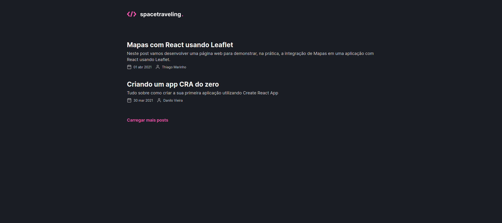
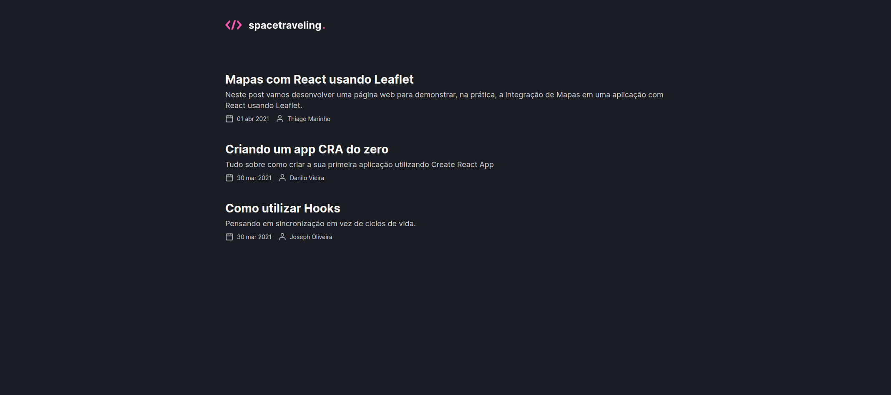
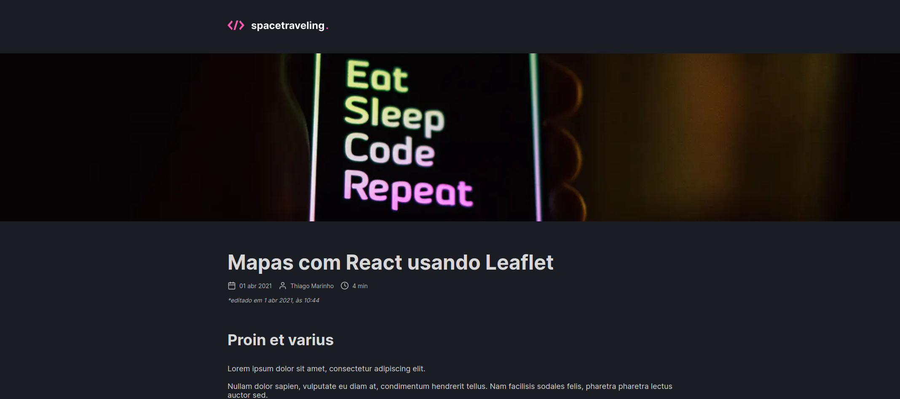
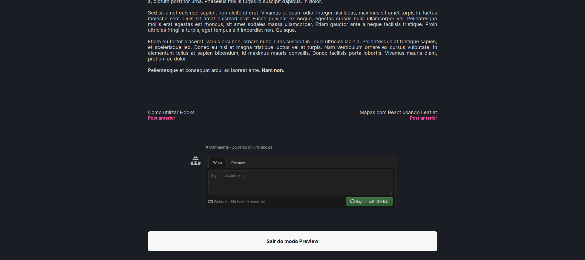
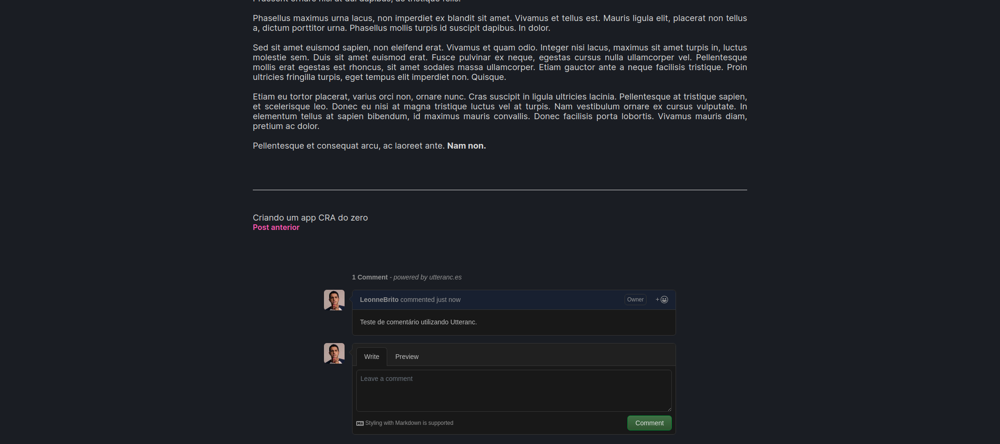

<p align="center">
   
</p>


<p align="center">
   :newspaper: Blog developed from scratch. Project developed during the third Bootcamp Ignite module | <a href="https://github.com/Rocketseat">@Rocketseat</a>
</p>

<div align="center">
  <sub> Made by
    <a href="https://github.com/danielalves96">Daniel alves.
  </sub>
</div>

# 📌 Contents

* [Screenshots](#camera-screenshot)
* [Technologies](#rocket-technologies)
* [How to Run](#computer-how-to-run)
* [Issues](#bug-issues)
* [License](#page_facing_up-license)

# :camera: Screenshots
<div align="center">
   
   
   
   
   
</div>

# :rocket: Technologies
This project was made using the follow technologies:

* [Typescript](https://www.typescriptlang.org/)
* [NextJS](https://nextjs.org/)
* [Prismic CMS](https://prismic.io/)
* [Utterances](https://utteranc.es/)
* [Jest](https://jestjs.io/pt-BR/)
* [Date-FNS](https://date-fns.org/)
* [React](https://reactjs.org/)
* [SASS](https://sass-lang.com/)

# :computer: How to run

```bash
# Clone Repository
$ git clone https://github.com/danielalves96/IGNITE-space.travelling.git
```

```bash
# Install Dependencies
$ yarn
```
Rename the .env.example file to .env.local and add the necessary environment variables.

```bash
$ yarn dev
```

Go to http://localhost:3000/ to see the result.


# :sparkles: Contributing

- Fork this repository;
- Create a branch with your feature: `git checkout -b my-feature`;
- Commit your changes: `git commit -m 'feat: My new feature'`;
- Push to your branch: `git push origin my-feature`.

# :page_facing_up: License

This project is under the [MIT license](./LICENSE).

Thank you! 🌠
